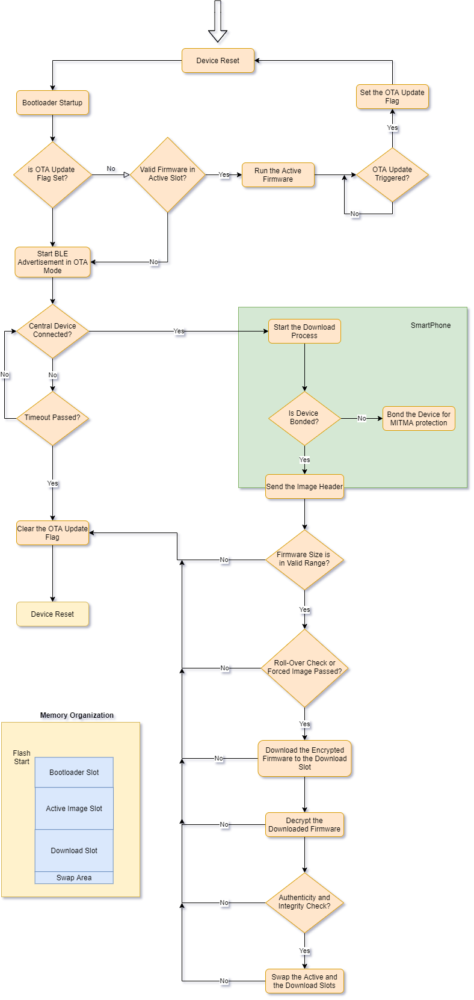

# BLE OTA Architecture

### Contents
---

- [Questions](#questions)
- [Main Concerns and How to Address Them in a Reliable OTA Update](#main-concerns-and-how-to-address-them-in-a-reliable-OTA-update)
- [BLE OTA Update - Suggested Method Flow Chart](#ble-OTA-update---suggested-method-flow-chart)

### Questions
---

You have an electronic IoT device, which uses `Bluetooth SoC` as a microcontroller. The device should support `OTA (Over The Air)` firmware updates via `BLE` communication. Your goal is to design a **reliable** OTA update architecture for the device and write a detailed, step-by-step description for the end to end process (block diagrams are welcome, no coding needed). 

```
- What are the main challenges in the process? 
```
```
- What are the security risks, when doing an OTA update, and how can you address these risks?
```

### Answers
---

#### Main Concerns and How to Address Them in a Reliable OTA Update

1. The firmware should always be recoverable from an unexpected situation, no matter what.
    1. A `Golden Image Procedure` can be used to revert the old firmware. This method requires **3 slots** in the memory. One slot for the active firmware, one slot for the downloaded firmware and one slot for the golden firmware image to be used when the active image and the downloaded image have been corrupted.
	2. A `Swap Procedure` can be used to revert the old firmware. This method requires **2 slots** and a **swap area** in the memory. One slot for the active firmware, one slot for the downloaded firmware and a small piece of memory to be used as a swap area while installing the new firmware. This way, the active firmware and the downloaded slot will be swapped after downloading the new firmware and in case of a failure of the downloaded firmware, the old active firmware can be reverted thanks to the swap area. *This will be the selected method used in the FlowChart in the next section.*
\
&nbsp;
2. The binary to be used in the update should be `Encrypted/Authenticated` and the `Integrity` of the binary should be checked before installation.
    1. `Encryption` ensures that even if the binary file has been stolen, they won't be able to use it on another custom board.
    2. `Authentication` ensures that even if someone manages to transfer a cracked and encrypted(with the correct keys) binary to the device, the bootloader will not accept to install it since it will know that it was signed by an unauthorized person.
	3. `Integrity` check is mandatory before installing the downloaded binary to understand if the file is valid and no change has been made intentionally or due to a problem with the download method.
\
&nbsp;
3. `OTA Triggering Method` must be accessible even if the firmware is invalid. Imagine you have a perfect OTA Bootloader solution but the method you are using to trigger an OTA update and running the bootloader is a BLE GATT Characteristic Write. A smartphone should write to this characteristic to trigger a firmware update but due to a problem with your firmware, it is not advertising anymore. Here are the steps to prevent that:
    1. The firmware download operations should be done inside the Bootloader or as an external loader firmware. You can not rely on your active firmware to download the new firmware and then jump to the bootloader. The firmware download and installations should be done inside the Bootloader firmware. This way, even if your firmware is broken, the bootloader can download a new one. But there is still one risk here. What if the firmware is not completely broken, it just works but you just can't trigger it to jump to the bootloader? In this case, you will lose the firmware update feature forever. What are the options to solve this problem?
		1. Put an interaction method to physically (e.g. button or needle switch) triggering a firmware update or recovery. This is the easiest and safest way but it might not be possible in every case. The workarounds are listed below.
	    2. A periodic reset by a hardware watchdog and an insanity check of the firmware in the bootloader before running the active firmware. The active firmware can set a flag in the memory (volatile or non-volatile) during normal operation to let the bootloader know that everything is okay about the triggering method(e.g. *I am able to advertise and a smartphone is able to discover my triggering GATT characteristic*). After every hard-reset (let's say every night), the bootloader can check and reset this flag and start advertising with the **OTA Bootloader Mode** if there is a problem. 
\
&nbsp;
4. Memory `Read/Write/Execute/Access Protections` should be set carefully. Here is the summary of that:
    - The **Bootloader Area** should not be accessible by any kind of operation from the MCU memory or an external programmer.
    - The **Active/Download Firmware Areas** must be accessible **only** from the **Bootloader Area** and not accessible by any kind of operation from an external programmer.
    - The `Encryption` and the `Authentication` keys must be inside the one-time-programmable area and accessible **only** by the Bootloader firmware.
\
&nbsp;
5. (Optional) `Roll-Over Mechanism` can be implemented to prevent duplicate installation. A **forced** flag can be added during the binary preparation to make the bootloader install the binary even if the new firmware version is equal or behind the current firmware version.
\
&nbsp;
6. (Optional) `Data Transfer Mechanism` can be encrypted by BLE `Pairing/Bonding` method. The data chunks transferred over the air by BLE can be encrypted thanks to the BLE's security mechanisms that are achieved by `Pairing/Bonding`. Without having this feature, the firmware security was already ensured by encrypting the binary file but for further increasing the security level of the OTA procedure, BLE Pairing/Bonding methods can be used. The Encryption/Authentication permissions of the GATT characteristics that are used for BLE file transfer can be set and any operation done over these characteristics will require the smartphone to have Pairing/Bonding for the embedded device. This mechanism adds protection for `Man-In-The-Middle Attack` on the BLE radio packets.
\
&nbsp;
7. (Optional) File transfer data-rate can be enhanced by increasing the `MTU Length`. It is possible to set the MTU size up to 512 bytes (depends on the smartphone, default: 23 bytes) by sending a GATT MTU Exchange Request from the smartphone. It is automatically done by the operation system on IOS devices but requires an additional process in Android devices.

#### BLE OTA Update - Suggested Method Flow Chart

Below is the flow chart of an example BLE OTA procedure, the memory layout is also given next to the chart.




	
	
	
	
	
	
	
	
	
	
	
	
	
	
	
	
	
	
	